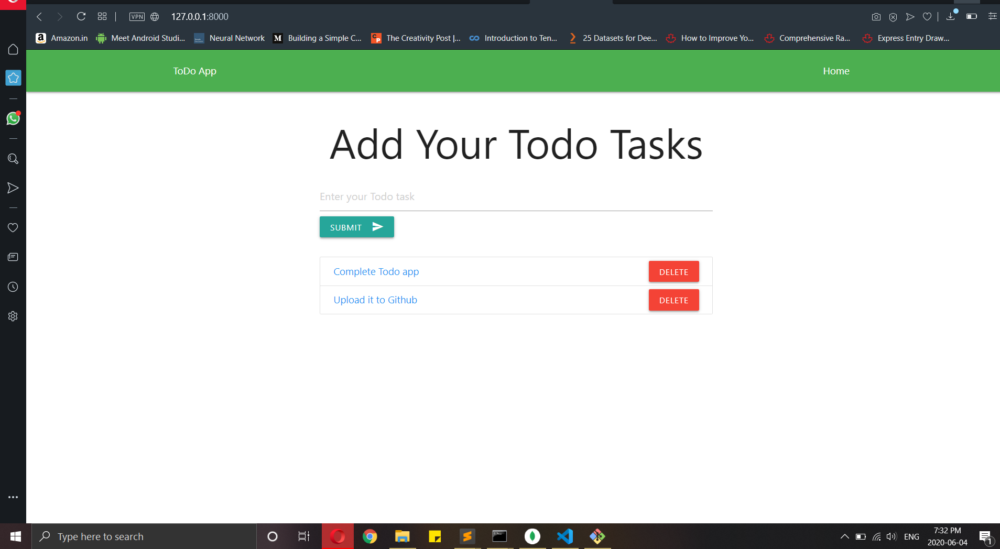

This Todo App is made using python , django , mongodb.
It will add your task and shows it to you on the screen and task will be deleted by just clicking delete button
With connection to mongodb it will save your tasks into database having tasks , date and id fields.

Localhosting:
In master branch databse will be hosted on locally

ServerHosting:
In server_db branch database will be hosted on MongoDB Atlas server

you can find the difference in 
'todo/views.py':
  here difference is in connect()

'settings.py':
  here difference is in DATABASE = [] 
   
Image of it:

